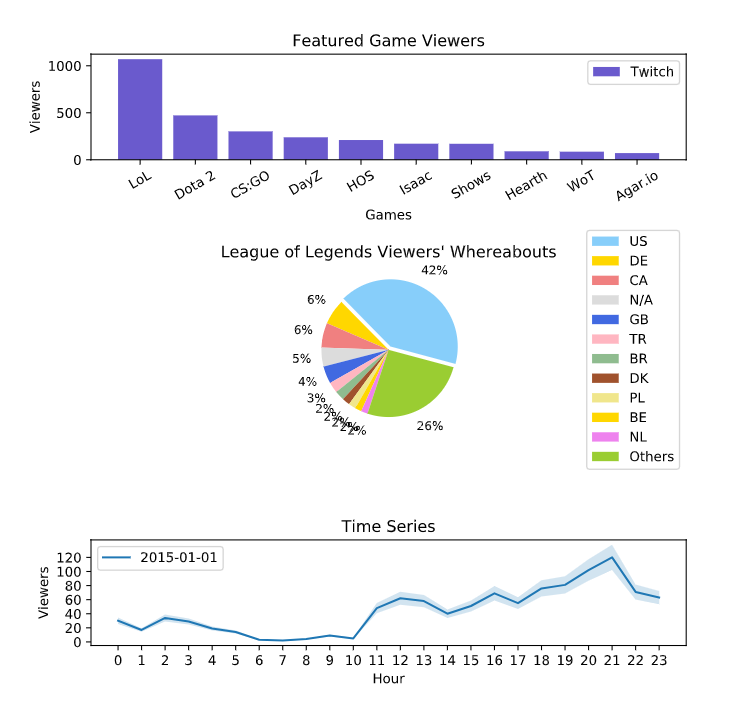

**12-Visualization-Cumulative-Projects**

<a href="Visualize_Data_with_Matplotlib.py">
Twitch Project 
script.py</a>
<li>Analyze Data with SQL</li>
<li>Visualize Data with Matplotlib</li>
</a>  
 
<a href="Visualizing_Kiva_Data_with_Seaborn.ipynb">
Kiva-Visualization-Project 
script.py</a>
<li>Aggregated Bar Charts</li>
<li>Box Plots</li>
<li>Violin Plots</li>
</a> 

