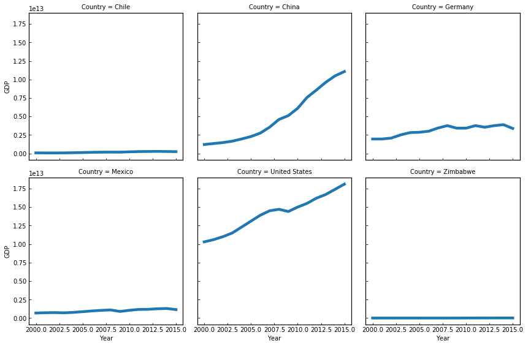
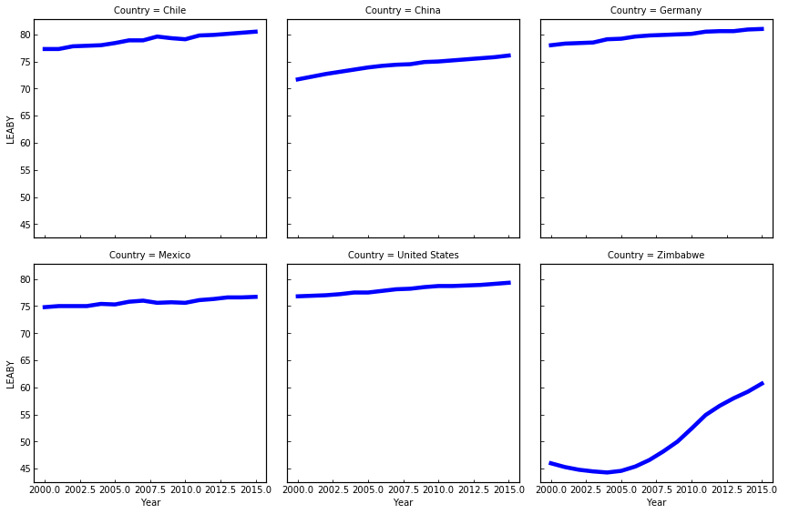

**Life Expectancy and GDP Data**

<a href="global_data_capstone_project.ipynb">
script.ipynb </a>  
<li>Investigation of correlation between the economic output of a country and the life expectancy of its citizens. </li>
<li>Analyze, Prepare, and Plot Data</li> 
  
  
    

                        

          
www.codecademy.com

