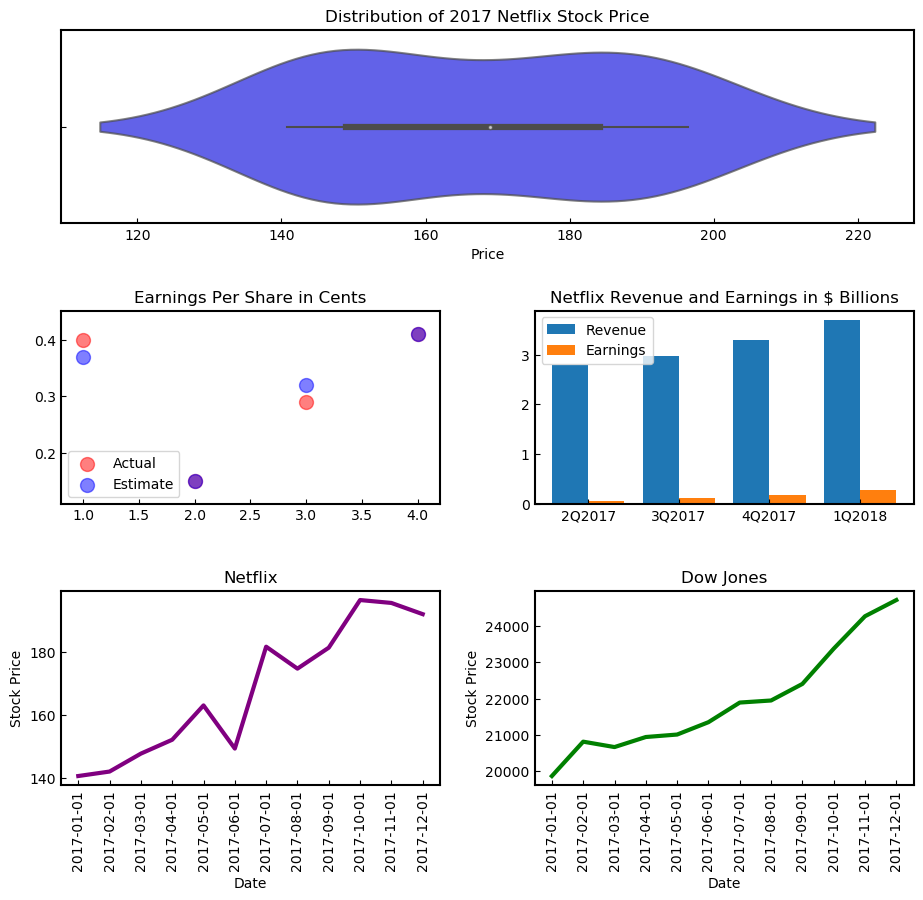

<a href="https://github.com/stefanm-git/Data-Science/tree/master/13-Data-Visualization-Capstone-Projects">13-Data-Visualization-Capstone-Projects</a>

**Netflix-Stock-Visualizations**

<a href="netflix_visualizations_project.ipynb">
script.ipynb </a>  
<li>Visualizations for a Stock Profile</li>
<li>Analyze, Prepare, and Plot Data</li> 
  

    
www.codecademy.com
