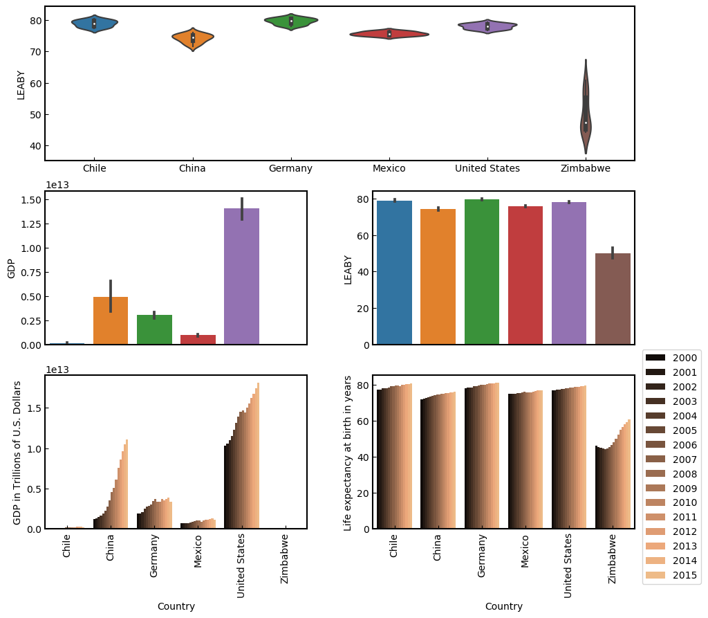

13-Data-Visualization-Capstone-Projects 
Capstone Project: Life Expectancy and GDP Data

<a href="global_data_capstone_project.ipynb">
Life-Expectancy-and-GDP-Capstone 
script.ipynb </a>  
  
  
  

                        

          
www.codecademy.com

