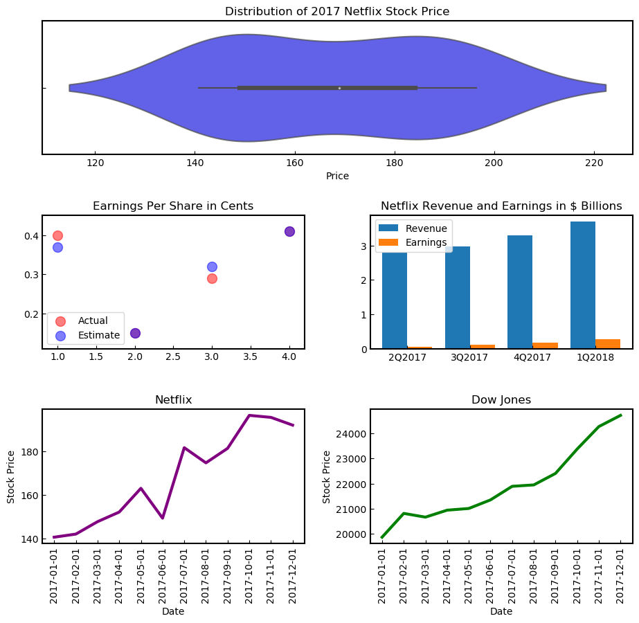

<a href="Data-Science">Data-Science</a>

**13-Data-Visualization-Capstone-Projects** 

<a href="Life-Expectancy-and-GDP-Capstone">
Life-Expectancy-and-GDP-Capstone </a>
<li>Investigation of correlation between the economic output of a country and the life expectancy of its citizens. </li>
<li>Analyze, Prepare, and Plot Data</li>

</a>  

<a href="Netflix-Stock-Visualizations">
Netflix-Stock-Visualizations </a>
<li>visualizations for a Stock Profile</li>
<li>Analyze, Prepare, and Plot Data</li>
</a>  

www.codecademy.com

