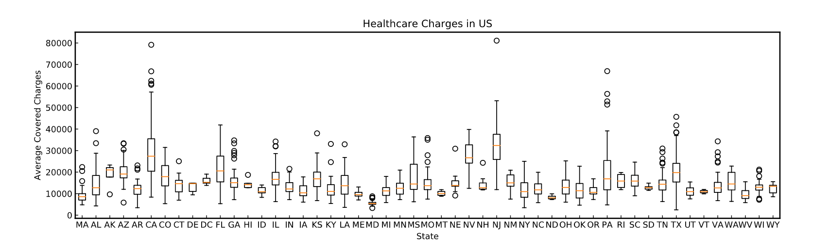

14-Learn-Statistics-with-Python 

  <b>Quartiles, Quantiles, and Interquartile Range</b> 
<a href="quartiles_quantile_interquantile_range_project.py">
Life Expectancy By Country 
script.py 
</a>  

<b>Boxplots</b> 
<a href="boxplots.py">
Healthcare in Different States 
script.py 
</a>  

www.codecademy.com

