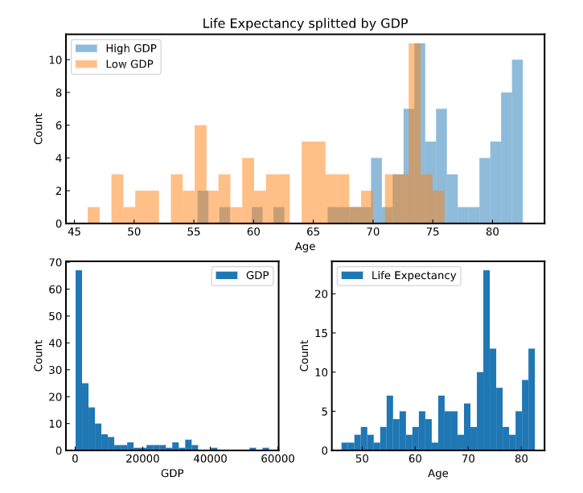
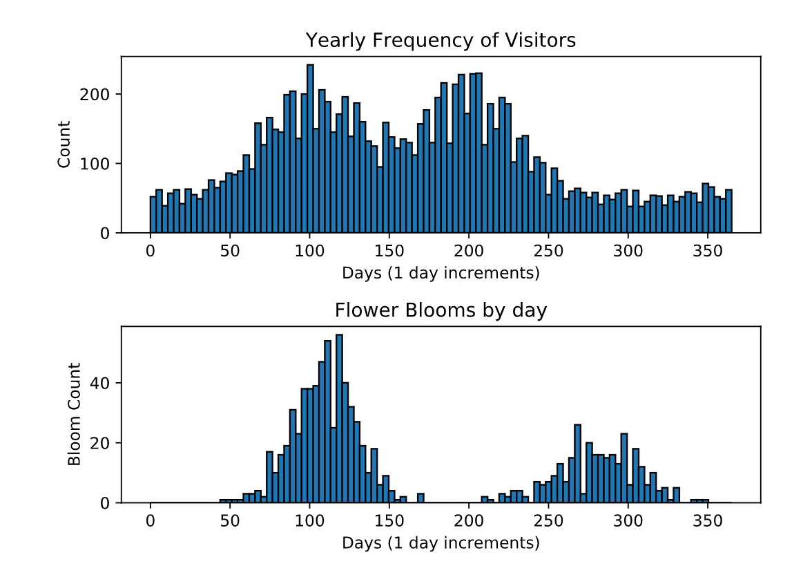

14-Learn-Statistics-with-Python 

  <b>Quartiles, Quantiles, and Interquartile Range</b> 
<a href="quartiles_quantile_interquantile_range_project.py">
Life Expectancy By Country 
script.py 
</a>  

<b>Boxplots</b> 
<a href="boxplots.py">
Healthcare in Different States 
script.py 
</a>  

<b>Histrograms</b> 
<a href="historgrams_project.py">
Travel to Acadia 
script.py 
</a>  

<b>Variance and Standard Deviation</b> 
<a href="variance_and_standard_deviation_project.py">
Variance in Weather 
script.py 
</a>  

<b>Mean, Meadian, and Mode</b> 
<a href="mean_median_mode_project.py">
Central Tendency for Housing Data 
script.py 
</a>  

www.codecademy.com

