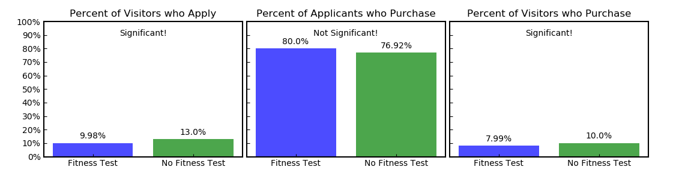
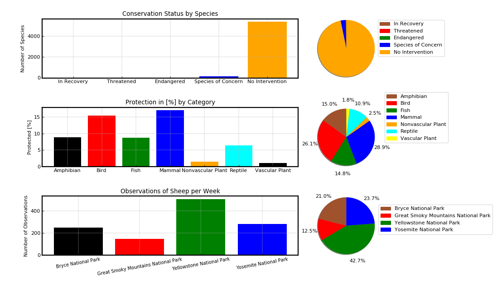

<a href="https://github.com/stefanm-git/Data-Science">Data-Science</a>

<b>Data Analysis Capstone Projects</b>  

<b>MuscleHub A/B Test</b> 
<a href="muscle_hub_abtest.py">
Help MuscleHub analyze an A/B test and choose a business strategy  
script.py</a>  
  

<b>Biodiversity in National Parks</b> 
<a href="biodiversity_project.py">
Analyze data about endangered species 
script.py</a>  
   
  
