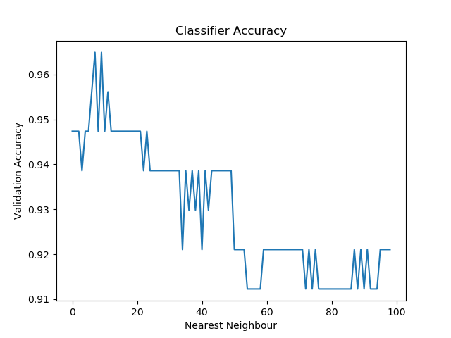

Machine Learning: Supervised Learning 🤖  
Breast Cancer Classifier

In this project, we will be using several Python libraries to make a K-Nearest Neighbor classifier that is trained to predict whether a patient has breast cancer. 

 
