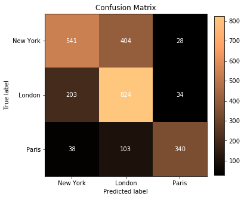
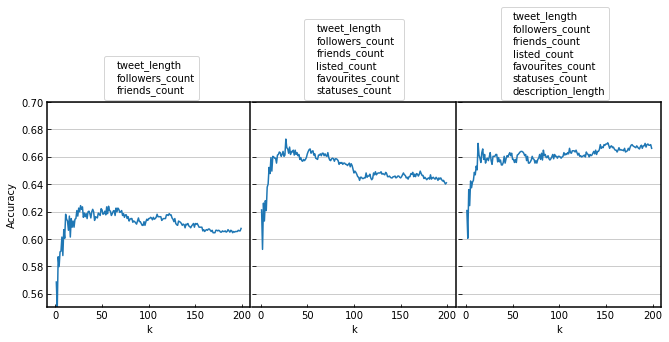

21. Supervised Machine Learning Cumulative Project 
Twitter Classification Cumulative Project

**Classifying Tweets Location - Naive Bayes** 
<a href="classifying_tweets_location.ipynb">
scipt.ipynb 
</a>       
**Classifying Tweets Viral - K-Nearest Neighbor** 
<a href="classifying_tweets_viral.ipynb">
scipt.ipynb 
</a>             

www.codecademy.com
