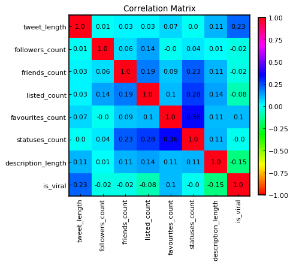

<a href="https://github.com/stefanm-git/Data-Science">Data-Science</a>

<b>21-Supervised-Learning-Cumulative-Project</b>  
  
Twitter Classification Cumulative Project 

<b>Classifying Tweets Location - Naive Bayes</b> 
<a href="classifying_tweets_location.ipynb">
scipt.ipynb</a> 
System that predicts whether or not a tweet will go viral by using a K-Nearest Neighbor classifier
   

<b>Classifying Tweets Viral - K-Nearest Neighbor</b> 
<a href="classifying_tweets_viral.ipynb">
scipt.ipynb</a> 
System that predicts whether a tweet was sent from New York City, London, or Paris
 
  

www.codecademy.com
