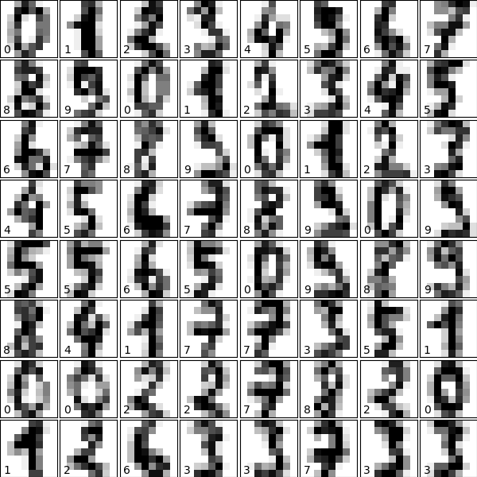

22. Machine Learning: Unsupervised Learning 🤖 
Handwriting Recognition using K-Means

In this project, you will be using K-means clustering (the algorithm behind this magic) and scikit-learn to cluster images of handwritten digits.

**Classifying Tweets Location - Naive Bayes** 
<a href="handwritten_recognition_kmeans.py">
scipt.ipynb 
</a>          

www.codecademy.com
