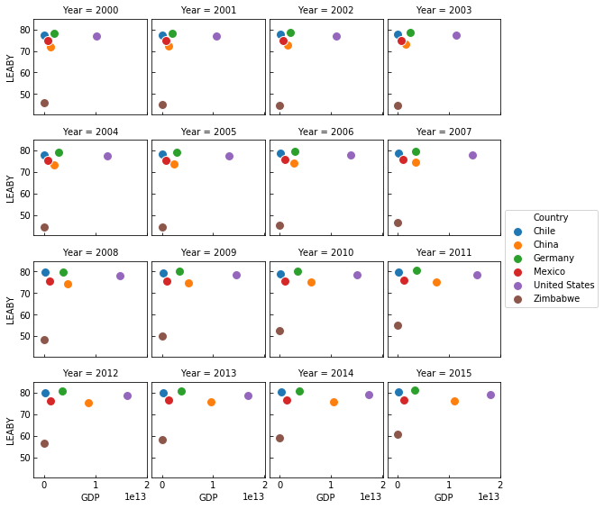

This directory contains selected projects from the "Data Science Career Path" of www.codecademy.com.

<a href="12-Visualization-Cumulative-Projects">
12-Visualization-Cumulative-Projects  
</a>  

<a href="13-Data-Visualization-Capstone-Projects">
13-Data-Visualization-Capstone-Projects  

</a>  

<a href="14-Learn-Statistics-with-Python">
14-Learn-Statistics-with-Python 
</a>  
         
<a href="18-Data-Analysis-Capstone-Project">
18-Data-Analysis-Capstone-Project 
</a>  

<a href="20-Machine-Learning-Supervised-Learning">
20-Machine-Learning-Supervised-Learning 
</a>  

<a href="21-Supervised-Learning-Cumulative-Project">
21-Supervised-Learning-Cumulative-Project 

</a>  

<a href="22-Machine-Learning-Unsupervised-Learning">
22-Machine-Learning-Unsupervised-Learning  

</a>  

